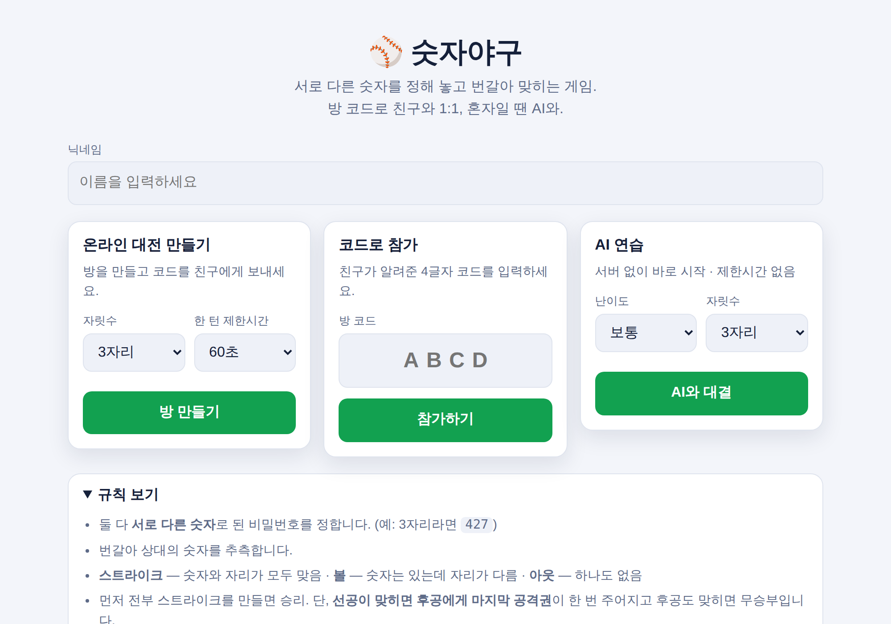
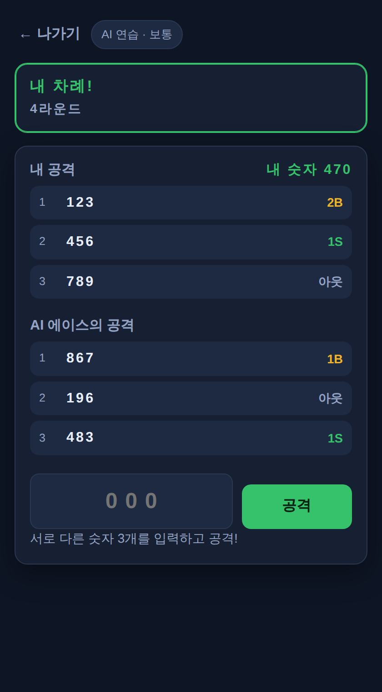

# 🎮 종합게임

브라우저에서 바로 하는 미니게임 모음. 설치할 앱도 회원가입도 없습니다.

| 게임 | 주소 | 모드 |
| --- | --- | --- |
| ⚾ 숫자야구 | `/` | 방 코드로 친구와 온라인 1:1 · 혼자일 땐 AI 연습 |
| 💣 지뢰찾기 | `/minesweeper` | 혼자 최고 기록 · 방 코드로 1:1 대전 (상대 판 실시간) |
| 🔍 틀린그림찾기 · 🐱 숨은 고양이 | `/spot` | 손그림 카툰 장면(거리·방·항구·정원) · 혼자 기록 · 같은 그림에서 먼저 찾기 1:1 대전 |

## ⚾ 숫자야구

방 코드 하나로 친구와 1:1 온라인 대전을 하고, 혼자일 땐 AI와 연습하는 숫자야구 게임.



## 무엇이 되나요

- **온라인 1:1 대전** — 방을 만들면 4글자 코드가 나옵니다. 친구에게 코드나 초대 링크를 보내면 끝.
- **AI 연습** — 서버 없이 브라우저 안에서 바로. 난이도 3단계(쉬움 / 보통 / 어려움).
- **3~6자리** — 방을 만들 때 자릿수와 한 턴 제한시간(30 / 60 / 120초 / 무제한)을 고릅니다.
- **끊겨도 안 끝남** — 새로고침하거나 잠깐 연결이 끊겨도 60초 안에 돌아오면 원래 자리에서 이어서 합니다.
- **재대결** — 둘 다 누르면 바로 다음 판. 선공은 자동으로 바뀝니다.
- **채팅** — 대전 중 간단한 메시지.
- 모바일 우선 레이아웃, 다크 모드 자동 지원.
- **💣 지뢰찾기** — `/minesweeper` 에서 클래식 지뢰찾기. 혼자 최고 기록에 도전하거나, 방 코드로 친구와 **1:1 대전**(상대 판이 실시간으로 보인다). 아래 [지뢰찾기](#지뢰찾기) 참고.



## 게임 규칙

1. 둘 다 **서로 다른 숫자**로 된 비밀번호를 정합니다. (3자리라면 `427` 처럼. `0`으로 시작해도 됩니다)
2. 번갈아 가며 상대의 숫자를 추측합니다.
   - **스트라이크(S)** — 숫자와 자리가 모두 맞음
   - **볼(B)** — 숫자는 있는데 자리가 다름
   - **아웃** — 하나도 없음
3. 먼저 전부 스트라이크를 만들면 승리.
4. 단, **선공이 맞히면 후공에게 마지막 공격권**이 한 번 주어집니다. 후공도 맞히면 **무승부** — 선공 이점을 없애기 위한 규칙입니다.
5. 제한시간을 넘기면 그 턴은 날아가고, **연속 3번** 놓치면 기권 처리됩니다.
6. 비밀번호를 정하는 시간(90초)을 넘기면 무작위 숫자가 자동으로 배정됩니다.

## 💣 지뢰찾기

같은 서버의 `/minesweeper` 에 들어 있습니다. 혼자 하기는 정적 파일만으로도 동작하고, 1:1 대전은 WebSocket 서버가 필요합니다.

- **난이도** — 쉬움 9×9·10, 보통 16×16·40, 어려움 16×30·99, 커스텀(최대 40×60).
- **첫 클릭은 안전** — 지뢰는 첫 클릭 뒤에 심고, 그 칸과 주변 8칸은 비워 둡니다.
- **주변 한꺼번에 열기** — 열린 숫자를 클릭하면 주변 깃발 수가 맞을 때 나머지를 엽니다. 깃발이 틀렸다면 터집니다.
- **조작** — PC: 왼쪽 클릭 열기 / 오른쪽 클릭 깃발 / 가운데 클릭 주변 열기. 모바일: 탭 / 길게 눌러 깃발 / 깃발 모드 토글. 키보드: 방향키 · Enter · F · N(새 게임).
- **화면에 맞추기** — 판이 크면(40×60 등) 너비와 높이에 맞춰 칸이 작아지고 주변 여백이 줄어듭니다. ⛶ 버튼으로 전체 화면에 판만 띄울 수도 있습니다.
- **최고 기록** — 프리셋 3개는 브라우저 `localStorage` 에 저장. 커스텀 판은 저장하지 않습니다.
- 물음표 표시는 옵션(기본 꺼짐).

### 1:1 대전

- 방을 만들면 4글자 코드가 나오고, 상대가 들어오면 3초 카운트다운 뒤 동시에 시작합니다.
- **판은 서로 다릅니다** (같은 크기·지뢰 수). 같은 판이면 상대 화면에서 안전한 칸이 그대로 새기 때문입니다. 대신 **출발 지점**을 서버가 미리 열어 줍니다.
- **점수로 승부합니다.** `점수 = 연 칸 × 10 − 걸린 초 × 1 + (다 열면 칸 수 × 5) − (지뢰를 밟으면 칸 수 × 2)`. 지뢰를 밟으면 내 판만 끝나고, 상대가 다 열거나 지뢰를 밟을 때까지 라운드가 이어집니다. 누가 다 열면 그 순간 끝 — 상대는 그때까지 연 만큼만. 많이 연 사람이 지뢰를 밟아도 적게 연 상대보다 앞섭니다. 점수가 같으면 무승부. 나가거나 60초 안에 재접속하지 않으면 기권(점수와 무관하게 패배).
- 상대 판은 열린 칸과 깃발만 실시간으로 보이고, 끝난 뒤에 지뢰가 드러납니다.
- 재대결은 둘 다 누르면 새 판으로. **승수**(이 방에서 이긴 판 수)는 사람에게 붙어서 재대결·교대를 해도 이어지고, 결과 화면에 점수 내역과 판별 기록이 남습니다. 채팅도 됩니다.
- **관전** — 코드로 관전 입장(방당 20명). 두 판을 실시간으로 보고 채팅할 수 있습니다. 빈 자리가 있으면 **앉기**, 자리가 찼으면 플레이어에게 **교대 요청** → 플레이어가 수락하면 자리를 바꿉니다(판이 끝난 뒤에만). 플레이어는 **관전으로 빠지기**로 자리를 비울 수 있습니다(진행 중이면 기권 처리). 새로고침해도 관전석으로 돌아옵니다.
- 판정은 서버(`shared/msversus.js`)가 합니다. 브라우저는 클릭 즉시 자기 판을 먼저 그리고(내 판의 지뢰 배치는 본인에게만 내려옵니다), 서버가 조작 번호(`n` / `ack`)까지 반영한 상태가 오면 그걸로 맞춥니다. 그래서 회선이 느려도 클릭이 굼뜨지 않습니다.

규칙은 `shared/minesweeper.js`(판 하나)와 `shared/msversus.js`(대전)에만 있고, 화면 코드(`public/js/minesweeper.js`)는 그 함수를 부르고 그리기만 합니다. `cellView()`/`encodeBoard()` 는 게임이 끝나기 전엔 지뢰 위치를 절대 내보내지 않습니다.

## 🔍 틀린그림찾기 · 🐱 숨은 고양이 찾기

`/spot`. 그림 파일이 없습니다 — **seed 하나로 손그림 카툰 장면을 SVG 로 생성**합니다 (`shared/scene.js`).

- **장면 4개** — 거리(상점가 건물·창문·차양·간판·사람·차·자전거·상자…), 방(소파·책장·창문·액자·화분·상자…), 항구(배·등대·생선 가게·상자·바구니·어부…), 정원(나무·온실·창고·연못·꽃밭·그네…). 한 장면에 물체 45~70개, 잉크 외곽선 + 살짝 떨리는 선 + 종이 질감.
- **틀린그림찾기** — 같은 장면 두 장에서 N 개 물체가 색 · 크기 · 위치 · 좌우반전 · 회전 · 개수(창문·꽃·줄무늬·쿠션…) · 삭제로 다릅니다. 쉬움 5 / 보통 7 / 어려움 10곳. 바뀐 쪽은 왼쪽/오른쪽 무작위.
- **숨은 고양이 찾기** — 장면 한 장에 고양이(앉기·식빵·잠·고개 내밀기·걷기, 얼룩·줄무늬·턱시도)가 창턱 · 상자 · 지붕 · 소파 · 나무 위 · 울타리 기둥 같은 자리에 숨어 있습니다. 쉬움 6 / 보통 10 / 어려움 15마리.
- 같은 seed 면 어디서든 같은 그림이라 대전 상대와 그림을 공유하는 데 seed 하나면 됩니다. 저작권 걱정도 없습니다.
- **혼자** — 시간 기록. 오답 +5초, 힌트 +20초(힌트를 쓰면 기록은 남지 않음). 게임·난이도별 최고 기록은 `localStorage`. 그림 번호(`#seed`) 칩을 누르면 같은 그림 링크(`/spot?seed=…&d=…&k=…`)가 복사됩니다.
- **1:1 대전** — 둘이 **같은 그림**을 보고, 먼저 찍은 사람이 그 곳을 가져갑니다(초록/노랑 동그라미로 실시간 표시). 다 찾히거나 제한시간(3분)이 끝나면 더 많이 찾은 쪽이 승리, 같으면 무승부. 틀리면 1.5초 잠김. 정답 위치는 서버만 알고 브라우저엔 찾은 것만 내려갑니다.
- 관전 · 교대 · 승수 · 채팅은 지뢰찾기와 같은 방 인프라를 그대로 씁니다.

장면 엔진은 `shared/scene.js`(소품 60여 종의 렌더러, 테마별 배치 규칙, 고양이 자리), 퍼즐 규칙은 `shared/spot.js`(차이 만들기 · 고양이 숨기기 · 판정), 대전은 `shared/spotversus.js`. 화면 코드(`public/js/spot.js`)는 부르고 그리기만 합니다. 대전 화면의 관전/교대/채팅 부품은 `public/js/vsui.js` 로 지뢰찾기와 공유합니다.

## 실행하기

Node.js 18 이상이 필요합니다.

```bash
npm install
npm start          # http://localhost:3000
```

개발 중에는 `npm run dev` (파일이 바뀌면 자동 재시작).

같은 와이파이의 휴대폰에서 테스트하려면 PC의 내부 IP로 접속하면 됩니다 (`http://192.168.x.x:3000`).

## 배포하기

WebSocket을 쓰기 때문에 **상시 실행되는 서버**가 필요합니다. 정적 호스팅(GitHub Pages 등)만으로는 온라인 대전이 동작하지 않습니다. (AI 연습 모드는 정적 파일만으로도 동작합니다.)

### Render

저장소를 연결하면 `render.yaml` 설정이 그대로 적용됩니다. 수동으로 만든다면:

| 항목 | 값 |
| --- | --- |
| Environment | Node |
| Build Command | `npm ci` |
| Start Command | `npm start` |
| Health Check Path | `/healthz` |

무료 플랜은 일정 시간 요청이 없으면 잠들기 때문에, 첫 접속이 느릴 수 있습니다.

### Railway

New Project → Deploy from GitHub repo 로 이 저장소를 고르면 자동으로 감지합니다.
포트는 `PORT` 환경변수로 들어오며 서버가 알아서 사용합니다. 따로 설정할 것은 없습니다.

### 환경변수

| 이름 | 기본값 | 설명 |
| --- | --- | --- |
| `PORT` | `3000` | 서버 포트 |
| `HOST` | `0.0.0.0` | 바인딩 주소 |

## 프로젝트 구조

```
shared/         서버와 브라우저가 함께 쓰는 순수 로직 (의존성 없음)
  baseball.js     숫자 검증, 스트라이크/볼 판정, 후보 생성
  engine.js       1:1 대전 상태머신 — 턴, 제한시간, 승패 판정
  minesweeper.js  지뢰찾기 규칙 — 지뢰 배치, 열기/깃발/주변 열기, 승패, 전송용 직렬화
  msversus.js     지뢰찾기 1:1 대전 상태머신 — 카운트다운, 판 두 개, 승패, 재대결
  scene.js        손그림 카툰 장면 엔진 — 소품 렌더러, 테마별 배치, 고양이, SVG
  spot.js         틀린그림찾기 · 숨은 고양이 — 차이 만들기, 고양이 숨기기, 판정
  spotversus.js   틀린그림찾기 1:1 대전 — 같은 그림, 먼저 찍은 사람이 가져감, 제한시간
server/
  index.js        HTTP(정적 파일) + WebSocket 서버
  rooms.js        방 코드 발급, 자리 배정, 재접속 유예, 브로드캐스트 (게임 종류별 규칙 모듈을 꽂아 쓴다)
public/
  index.html      화면 뼈대
  css/style.css
  js/app.js       화면 그리기와 입력 처리
  js/net.js       온라인 엔진 (WebSocket, 자동 재접속) — 숫자야구와 지뢰찾기가 같이 쓴다
  js/local.js     AI 연습 엔진 (같은 상태머신을 브라우저에서 구동)
  js/ai.js        AI 상대 — 난이도별 추론
  minesweeper.html / css/minesweeper.css / js/minesweeper.js
                  지뢰찾기 화면 (혼자 + 1:1 대전)
  js/msboard.js   지뢰판 렌더러 + 입력 (내 판과 상대 판이 같이 쓴다)
  js/vsui.js      1:1 대전 공통 부품 — 연결 표시, 채팅, 승수, 관전자 패널, 교대 요청
  spot.html / css/spot.css / js/spot.js
                  틀린그림찾기 화면 (혼자 + 1:1 대전)
test/           node:test 기반 단위 + 통합 테스트
```

핵심은 **규칙이 `shared/engine.js` 한 곳에만 있다**는 점입니다.
온라인 모드는 서버가 이 상태머신을 돌리고, AI 모드는 브라우저가 똑같은 것을 돌립니다.
두 엔진이 같은 모양의 상태를 내보내기 때문에 화면 코드는 둘을 구분하지 않습니다.

### AI는 어떻게 두나요

지금까지 받은 단서와 모순되지 않는 후보를 추려 그중 하나를 고릅니다.
난이도는 **단서를 얼마나 기억하느냐**로 조절합니다 — 쉬움일수록 과거 단서를 자주 잊고(`memory`), 가끔은 아무 숫자나 던집니다(`noise`). 값은 `public/js/ai.js` 의 `PROFILES` 에 모여 있습니다.

| 난이도 | 단서 기억률 | 무작위 확률 |
| --- | --- | --- |
| 쉬움 | 45% | 30% |
| 보통 | 80% | 10% |
| 어려움 | 100% | 0% |

## WebSocket 프로토콜

`/ws` 로 접속해 JSON 메시지를 주고받습니다.

**클라이언트 → 서버**

| 메시지 | 내용 |
| --- | --- |
| `{t:'create', game?, name, ...옵션}` | 방 만들기. `game` 은 `'baseball'`(기본) 또는 `'minesweeper'`. 옵션은 숫자야구 `digits, turnSeconds` / 지뢰찾기 `rows, cols, mines` |
| `{t:'join', game?, code, name}` | 방 참가 (`game` 을 적으면 다른 게임의 방은 거절) |
| `{t:'rejoin', game?, code, token}` | 끊긴 자리로 복귀 |
| `{t:'secret', value}` | (숫자야구) 내 비밀번호 확정 |
| `{t:'guess', value}` | (숫자야구) 공격 |
| `{t:'ms', a, i, n, q?}` | (지뢰찾기) 내 판 조작. `a` = `reveal` / `mark` / `chord`, `i` = 칸 번호, `n` = 조작 번호, `q` = 물음표 사용 |
| `{t:'spot', x, y}` | (틀린그림·숨은 고양이) 그림 찍기 (장면 좌표 640×480). 본인에게 `{t:'spot_result', hit, index, lockedUntil}` 이 먼저 온다 |
| `{t:'watch', game, code, name}` | (지뢰찾기 · 틀린그림) 관전 입장 |
| `{t:'sit'}` / `{t:'stand'}` | 관전자가 빈 자리에 앉기 / 플레이어가 관전으로 빠지기 |
| `{t:'swap', seat}` | 관전자가 `seat` 번 자리 사람에게 교대 요청 (`seat: null` 이면 취소) |
| `{t:'swap_accept', pid}` / `{t:'swap_decline', pid}` | 플레이어가 교대 요청 수락 / 거절 |
| `{t:'chat', text}` | 채팅 |
| `{t:'rematch'}` / `{t:'surrender'}` / `{t:'leave'}` | 재대결 / 기권 / 나가기 |

**서버 → 클라이언트**

| 메시지 | 내용 |
| --- | --- |
| `{t:'joined', code, game, role, you, token}` | 자리 배정(`role:'player'`, `you` = 자리 번호) 또는 관전석(`role:'spectator'`) + 재접속 토큰. 교대·앉기·빠지기로 역할이 바뀔 때도 온다 |
| `{t:'state', code, game, role, you, view, ack, chat, grace, people, swaps}` | 플레이어 상태 (바뀔 때마다). `ack` 는 서버가 반영한 내 마지막 조작 번호, `people` 은 방 사람들, `swaps` 는 내 자리로 들어온 교대 요청 |
| `{t:'state', code, game, role:'spectator', view, chat, people, freeSeat, mySwap}` | 관전자 상태 |
| `{t:'error', code, message}` | 거절 사유 |

`view` 에는 **상대의 비밀번호(숫자야구) / 상대 판의 지뢰 위치(지뢰찾기)가 들어 있지 않습니다.** 게임이 끝난 뒤에만 공개됩니다.

## 테스트

```bash
npm test
```

- `test/baseball.test.js` — 판정 규칙
- `test/engine.test.js` — 상태머신 (마지막 공격권, 무승부, 시간 초과, 기권, 재대결, 정보 은닉)
- `test/server.test.js` — 실제 서버를 띄워 소켓 두 개로 한 판을 끝까지 진행, 재접속과 에러 처리까지
- `test/minesweeper.test.js` — 지뢰찾기 규칙 (첫 클릭 안전, 번짐, 깃발, 주변 열기, 승패, 정보 은닉, 직렬화 왕복)
- `test/spot.test.js` — 장면 생성(테마별 밀도·슬롯 상한·고양이 자리), 틀린그림(seed 결정성, 차이 수, 보이는 곳), 숨은 고양이(수·간격), 판정, SVG, 정답 은닉
- `test/spotversus.test.js` — 틀린그림 1:1 (같은 퍼즐, 먼저 찍기, 오답 잠김, 제한시간, 기권·재대결, 자리, 뷰 은닉)
- `test/msversus.test.js` — 지뢰찾기 1:1 (점수 공식, 카운트다운, 서로 다른 판, 지뢰 뒤 라운드 지속, 다 열기, 무승부, 기권, 재대결, 자리 비우기/앉기와 승수 이전, 상대 판 은닉, 관전자 뷰)

## 라이선스

MIT
